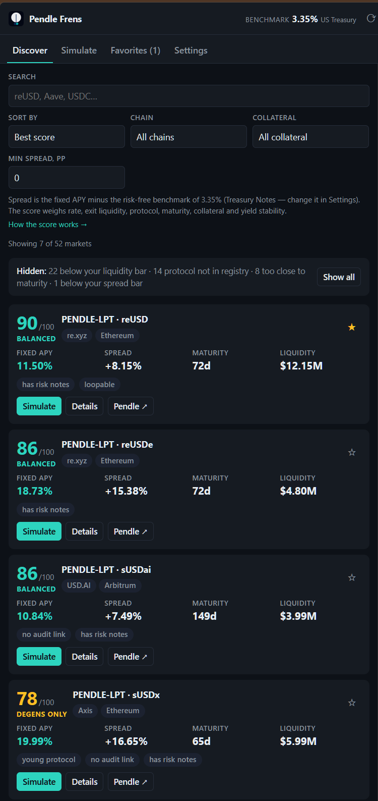
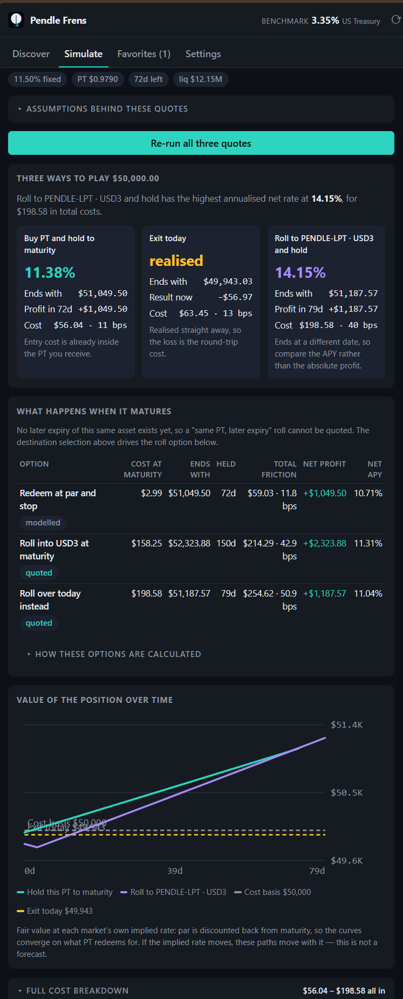
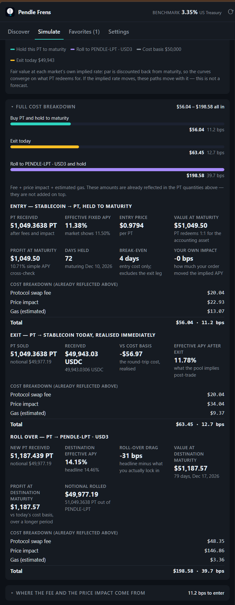

<p align="center">
  
</p>

# Pendle Frens

[](https://github.com/zhouzhuojie/pendle-frens/actions/workflows/ci.yml)
[](LICENSE)

A read-only Chrome side panel for finding **risk-adjusted fixed-yield PT opportunities** on
[Pendle](https://app.pendle.finance), and for pricing what an entry, exit or roll-over *actually* costs
at your size.

No wallet, no signing, no telemetry, no background polling. It reads two public APIs, does the math
locally, and deep-links you to Pendle when you want to act.

> **Not affiliated with Pendle.** This is a research tool, not financial advice.

## Install

> **Chrome Web Store: coming soon.** The listing is being prepared for submission. Until it is
> approved, the link below is a **placeholder and is not live** — build from source in the meantime,
> which takes about a minute.

```
https://chromewebstore.google.com/detail/pendle-frens/coming-soon   ← placeholder, not live yet
```

### From source

```bash
git clone https://github.com/zhouzhuojie/pendle-frens.git
cd pendle-frens
npm install && npm run build
```

Open `chrome://extensions`, turn on **Developer mode**, click **Load unpacked** and select the `dist/`
folder. Click the toolbar icon to open the side panel. Requires Chrome 120+.

## The four tabs

| Tab | Answers |
| --- | --- |
| **Discover** | Which PTs are worth a look — ranked by a score you can audit, with a stated reason for every market that is hidden |
| **Simulate** | Entry, exit and roll-over quoted together, plus a maturity plan and a value-over-time chart |
| **Favorites** | A shortlist with the rate drift since you starred it |
| **Settings** | Thresholds, chains, benchmark override, cache controls |

There is no fifth tab for the methodology: **Method** opens from any score, or from *How the score works*
above the list. It explains every weight, threshold and formula in plain language.

## Screenshots

| Discover | Simulate — the three paths | Simulate — cost detail |
| :---: | :---: | :---: |
|  |  |  |
| Ranked markets, each score opening its own explanation | Three paths compared, the maturity plan, and value over time | Every cost, the route, and both fee derivations |

## The score

Every market leads with a score out of 100 and a verdict. All six factors — what each scored, how much
of the total it carried, and the measurement behind it — are on the card, and **Method** explains the
whole thing.

| Factor | Weight | Question it answers |
| --- | --- | --- |
| Spread vs benchmark | 28% | How much more than a risk-free Treasury of similar duration? |
| Exit liquidity | 22% | Could I sell early without moving the price against me? |
| Protocol depth | 22% | How substantial is the protocol you are lending to? |
| Maturity fit | 10% | Does the lock-up match a sensible holding period? |
| Collateral quality | 10% | What does the PT actually redeem into? |
| Yield stability | 8% | Is this a durable level, or a spike I am buying the top of? |

If a factor cannot be computed it is dropped and the remaining weights are re-normalised, so the 0–100
scale stays honest. The weights, bands and verdict rules are exported constants, and the Method page is
generated from those same constants — `tests/score.test.ts` fails if the prose stops matching the code.

**There is no registry and no curation.** Protocol depth is measured, not judged: a weighted blend of
total TVL, number of active markets, number of chains and Pendle's Prime flag, from the snapshot alone.
It measures size and breadth, **never trust** — a large protocol can still fail — so the app makes no
protocol-level judgement anywhere and never calls a protocol "safe". See
[DESIGN.md](docs/DESIGN.md#no-registry-measure-protocol-depth-instead).

## Beyond the score: the rest of Pendle's data

Pendle's API publishes more than the score uses, and the detail page shows it — always labelled with
*who* it applies to, because most of it is not the PT holder's:

- **Yield provenance** — the provider's own split of a market's yield (underlying interest, PT
  convergence, PENDLE and external rewards), each group marked as applying to the underlying, the YT
  side or LP positions.
- **Rewards & points** — points programmes and weekly PENDLE emissions, each saying who earns it.
  Emissions go to LPs, not to PT holders.
- **Limit orders** — whether resting orders exist and at what fixed rate, plus the maker incentive.
  Rates only: the provider returns sizes in units it does not document, so the panel never invents a
  dollar depth.
- **Leverage (PT looping)** — the money markets that accept this PT as looping collateral, with the
  venue's maximum leverage, borrow rate (7-day average) and Pendle's own risk panel. The
  *net-at-max-leverage* figure is our arithmetic on top of Pendle's inputs, and the liquidation risk
  is stated beside it.
- **Long-range history** — daily points back to Pendle's ~1440-point cap (years, not weeks), kept
  separate from the hourly series the score reads.
- **Live rate** — a block-fresh spot quote, shown when it differs from the snapshot.

**None of this feeds the score.** The score stays the six documented factors, so new data cannot
silently change a verdict.

## Cost forensics

Every quote carries a **Route, fees and price impact** block built from the quote's own transaction
calldata rather than from assumptions: the venues, each leg's impact, the router method and address,
any bundled limit-order fills, the approvals the transaction will need, and gas as
`units × gwei × live native price`.

Pendle charges its AMM fee on the *implied rate* it moves, and that rate is annualised, so:

```
fee ≈ Σ over AMM legs  feeRate × notional × daysToMaturity / 365
```

`feeRate × notional` on its own overstates the fee by roughly 5× on a 72-day market, and longer-dated
paper costs more to trade at the same size. A PT→PT roll has **two** AMM legs — `swapExactPtForToken`
on the source, then `swapExactTokenForPt` on the destination — which is why a roll costs more than an
entry of the same size. The formula was verified against the live API across eight markets
(`feeRate` 9.8–40.9 bps, maturities 23–170 days) to within 0.4%.

**The panel shows the SDK's number and its own derivation side by side, plus the difference.** A tool
that shows only its own arithmetic can hide a mistake; a tool that shows both cannot.

## The maturity plan

A PT position has a second decision after entry, so the simulator prices it up front — redeem at par,
roll into the successor at maturity, or roll over today:

```
reUSD · 72 days · $50,000 in
  Redeem at par and stop             cost   $1 · ends $51,055 ·  72d · net $1,055 · 10.75%
  Roll into the successor at maturity cost  $56 · ends $52,867 · 221d · net $2,867 ·  9.50%
  Roll over today instead            cost $181 · ends $51,286 ·  79d · net $1,286 · 11.90%
```

Holding to maturity has **no exit cost**: one PT redeems for one accounting unit through the SY
redeemer, which is a protocol action, not an AMM swap — so there is no swap fee and no price impact,
only gas. A maturity roll is therefore priced as a *fresh entry* into the successor sized at the
expected redemption proceeds, not as a round trip. Each row says whether its cost is **quoted** or
**modelled**, and rows end on different dates, so annualised net APY is shown next to absolute profit.

## Discover never hides anything silently

Screened-out markets are summarised as a count with reasons, with a one-click **Show all**:

```
Hiding 20 markets: 13 below your liquidity bar · 4 too close to maturity
                 ·  2 below your spread bar     · 1 model would avoid
```

*Show all* ignores your quality bars but never your explicit choices — chain, collateral type and
search text still apply. `src/lib/domain/screen.ts` returns exactly one attributable reason per hidden
market, so the UI can print a truthful histogram instead of dropping rows. Any filter that can remove a
row must be able to say why.

## Privacy & permissions

| Permission | Why |
| --- | --- |
| `storage` | favorites, settings and cached market data — all local |
| `sidePanel` | the extension's entire UI surface |
| `host_permissions` | exactly two hosts: `api-v2.pendle.finance` and `api.fiscaldata.treasury.gov` |

No `alarms`, no `notifications`, no `tabs`, no `<all_urls>`, no content scripts, no analytics, no remote
code, and no wallet access. The service worker exists only to register the side-panel behaviour at
install — 27 lines, no network, no state, no timer. Because nothing runs in the background, a user who
never opens the panel spends **zero** API units. `tests/manifest.test.ts` asserts all of this, so the
permission list cannot creep in unnoticed.

The one way a request can leave those two hosts is the off-by-default **Load market logos** setting:
turning it on fetches each market's logo from Pendle's image CDN (`storage.googleapis.com`), which tells
that host which markets you are viewing. It is off by default, and the default is a local monogram.

## Develop

```bash
npm run dev         # rebuild dist on save; click ⟳ in chrome://extensions to reload
npm test            # offline unit + jsdom render tests — no network
npm run typecheck
PF_LIVE=1 npm test  # opt-in: hits the real APIs and spends computing units
npm run brand       # regenerate the icons, header mark and banner
```

`PF_LIVE=1` is bash syntax — on Windows use Git Bash, or `$env:PF_LIVE=1; npm test` in PowerShell.

The live suite proves the data path against real markets and drives the real panel data client against
both APIs with a mocked `chrome` surface, including that a cache hit does not rewrite storage and that
the panel never messages a worker. Worth running before a release.

## Layout

```
src/lib/api/        Pendle + U.S. Treasury clients, raw→domain normalizers, and client.ts
                    (fetch + TTL cache + single-flight — the only thing the panel calls)
src/lib/domain/     pure logic: types, chains, protocol, decision, rewards, book, looping, score,
                    screen, history, simulate, route
src/lib/storage/    chrome.storage access layer
src/background/     the MV3 service worker: side-panel registration, nothing else
src/panel/          panel controller, components, and one file per view
scripts/            brand generator — no image dependency
tests/              offline unit + jsdom render tests, plus opt-in live tests
```

[docs/DESIGN.md](docs/DESIGN.md) covers how it works and why the odd-looking parts are deliberate.
[CONTRIBUTING.md](CONTRIBUTING.md) covers the two changes people actually make.

## Contributing

Issues and pull requests are welcome. [CONTRIBUTING.md](CONTRIBUTING.md) covers setup, the ground
rules and the two changes people actually make; [CODE_OF_CONDUCT.md](CODE_OF_CONDUCT.md) applies to
every project space. For a vulnerability, use [private reporting](SECURITY.md) rather than a public
issue.

This project ships **zero runtime dependencies** and no telemetry, and `tests/manifest.test.ts`
keeps the permission list from growing silently — please help it stay that way. Changes are
summarised in [CHANGELOG.md](CHANGELOG.md).

## License

MIT — see [LICENSE](LICENSE). The brand artwork in `docs/brand/` is covered by the same licence.
